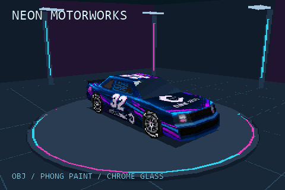
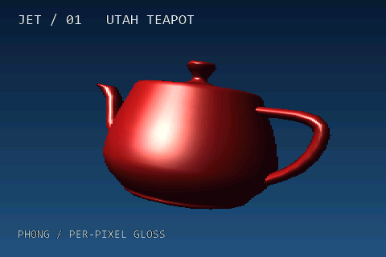
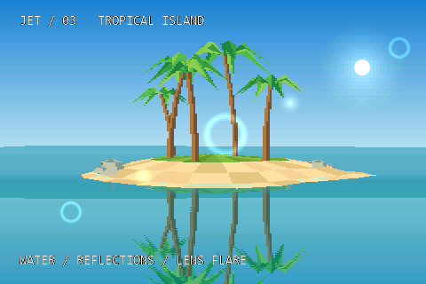

<p align="center">
  
</p>

# Jet

**Jet** is a dependency-free, fixed-function 3D software rasteriser written in
C++17. It targets embedded hardware with limited CPU and memory, including
ESP32 and STM32, and also runs on desktop PCs and Raspberry Pi.

Jet uses integer arithmetic in the rasterisation hot path and native 16-bit
RGB565 colour for output to embedded displays. It supports flat-shaded, lit
and textured geometry for low-poly games and visualisations.

On an ESP32-S3, Jet achieves **up to 100k tris/sec** in the
[tropical island example](https://github.com/CubeCoders/JetExamples/blob/main/esp32-tropical-island/VALIDATION.md).
This measures rasterized triangles over render time, excluding display scanout
and frame pacing. Throughput varies with scene complexity, triangle size and
enabled rendering features.

See the [ESP32 optimisation measurements](docs/ESP32Performance.md) for exact
indexed-texture results, memory costs and supported sampling paths.

## Community

Share projects and get help on the [Discord server](https://discord.gg/FSdJYDTEYt).

## Demos and examples

Explore [JetExamples](https://github.com/CubeCoders/JetExamples): sixteen standalone
ESP-IDF projects, from a reusable rotating-cube template and individual feature
demos to two complete demoscene showcases. The repository includes build
instructions, reference wiring, and display/SPI configuration for ESP32-S3 and P4.

[**Neon Motorworks**](https://github.com/CubeCoders/JetExamples/tree/main/esp32-neon-car)
combines runtime OBJ loading, textured Phong paint and environment-mapped windows:

[](https://github.com/CubeCoders/JetExamples/tree/main/esp32-neon-car)

These native software captures use the examples' **ESP32-level visuals**:
480×320 output, RGB565 colour and half-width interlaced field buffers, with
the performance overlay hidden. Click an image to explore its example.

| Lighting and reflections | Complete showcases |
| --- | --- |
| [](https://github.com/CubeCoders/JetExamples/tree/main/esp32-lighting-teapot)<br>**Utah teapot** — smooth normals and glossy Phong lighting. | [](https://github.com/CubeCoders/JetExamples/tree/main/esp32-neon-film)<br>**ESP 88** — a neon city cinematic with rain, reflections and a car chase. |
| [](https://github.com/CubeCoders/JetExamples/tree/main/esp32-tropical-island)<br>**Tropical island** — rippled water, reflections and lens flares. | [](https://github.com/CubeCoders/JetExamples/tree/main/esp32-matter)<br>**MATTER** — three minutes of procedural sculpture, movement and colour. |

See the [full gallery and build instructions](https://github.com/CubeCoders/JetExamples#build-and-run)
to run these scenes on your own hardware.

## Feature highlights

Compile-time switches in `JetConfig.hpp` let you disable features to reduce
CPU, RAM and flash usage. See [`src/JetConfig.example.hpp`](src/JetConfig.example.hpp)
for the available options.

### Rendering

- Triangle and quad meshes with per-face material assignment.
- Opt-in [shared mesh instancing](docs/instancing.md) to reduce repeated geometry
  storage, with independent placements and material overrides.
- Flat, Gouraud, Phong and wireframe shading modes (per material).
- Affine and perspective-correct texture mapping; optional bilinear filtering.
- Optional Z-buffering, or painter's-algorithm sorting (per-object and/or
  per-triangle). `Object::preciseDepthSort` refines occupied painter buckets by
  triangle mean depth for overlapping parts, without a depth allocation. It is
  opt-in and does not resolve intersecting/cyclic polygons.
- Optional `JET_PERSPECTIVE_DEPTH` reciprocal-Z interpolation for desktop depth
  accuracy on large sloping faces (`Z_BUFFERING=1`, `FAST_Z=0`). It adds a pixel
  division and defaults off.
- Backface and frontface culling, depth bias for decals and shadows, per-object
  blend modes (replace, add, subtract, multiply, average, XOR).
- Screen-door alpha and noise-based dithering for transparency.
- Per-object distance-based fading to reduce LOD popping and
  scene-wide depth fog.
- Half-width framebuffers, interlaced field buffers and checkerboard rendering
  with optional reconstruction.
- **`WATER_REFLECT` shading mode**: animated screen-space water surface.
  Reflects the background sky gradient about a camera-pitch-correct waterline,
  with per-material ripple amplitude (`specular`) and vertical bias
  (`waterYBias`). Blended toward a flat tint by `material->alpha`.
- **`ADDITIVE` shading mode**: saturating-add blend (src × alpha + dst)
  for emissive effects such as neon signs and explosion halos.
- **`SSR_FIELD_REFLECT`**: when `FIELD_BUFFERS` is active, `WATER_REFLECT`
  samples mirror pixels from the *previous* committed field buffer so
  reflections avoid draw-order dependencies across parallel rendering bands.
- Perspective-correct Phong normal interpolation.

### Lighting

- Ambient and directional lights with Flat, Gouraud or Phong shading.
- Optional `Z_BRIGHTNESS` depth darkening.

### Post-FX

- Effects without an extra buffer: CRT scanlines, cell-shading.
- Buffered effects (large-RAM targets): FXAA, bloom, motion blur,
  chromatic aberration, pixelation.

### Tooling

- `Primitives::create*` helpers for cubes, spheres, cylinders, capsules,
  pyramids, grids, planes, quads and billboards.
- Minimal Wavefront `.obj` loader.
- Optional screen-space picking (compile-time bounded; zero cost when set to
  0). Returns the closest hit object, triangle index, depth and snapped pixel
  coordinate.
- Animated palette textures: `Texture::advancePalette(dt, fps)` cycles the
  palette offset by `dt × fps` entries per call; no-op when `paletteSize` is 0.
- Custom shader entry point for extending the fixed-function pipeline.

### 2D Sprites

`Sprite2D` draws overlays after `render()`. It supports textured or solid-colour
fills, colour-key transparency, alpha and additive blending, integer upscaling,
and `zOrder`-based draw order. On `HALF_WIDTH_BUFFERS` builds, sprites are
composited at full output resolution during display scanout.

Display integrations can call `Renderer::compositeSprites(line, width, y,
sprites, count, swapDestination)` from `Sprite2D.hpp` to blend one RGB565 output
row. Pass `true` for byte-swapped panel buffers, or leave it `false` for native
RGB565. The helper clips to the row width, allocates nothing and paints in the
supplied order; sort by `zOrder` before scanout and keep sprite, material and
texture storage stable until it finishes. It has no ESP32 dependencies.

Set `textureFlags` to `Sprite2D::FLIP_X` and/or `FLIP_Y` to flip an image.
`MIRROR_X` and `MIRROR_Y` append reflected halves: combining both draws a
32×32 top-left quarter as a symmetric 64×64 sprite, using one quarter of
the texture storage. Mirroring preserves integer scaling and colour-key
transparency without extra sprite instances.

### Particles

`ParticleSystem` uses a fixed pool and renders through the rasteriser after
`scene->render()`. It includes spark and water-splash emitters, distance
culling, and configurable emitter counts and particle lifetimes.

### Lens flare

`LensFlare` projects a directional light source to screen space and positions
a sprite chain along the axis between the sun and screen centre. Fade speed,
per-element axis offset (`axisT`), alpha, blend mode and integer scale are
configurable. It can use a pick slot for sun occlusion testing; with
`MAX_PICK_QUERIES = 0`, the sun is treated as unobstructed.

## Getting started

Your application provides the framebuffer, display driver and main loop.
Add Jet as a CMake subdirectory or ESP-IDF component, provide a
`JetConfig.hpp` on your include path (copy and customise
`src/JetConfig.example.hpp`), then call `scene->render()` once per frame.

For ESP-IDF, depend on it as you would any other component:

```yaml
# main/idf_component.yml
dependencies:
  jet: "*"
```

### Minimal example

Allocate colour and depth buffers, add a camera, lights and a cube, then
render each frame:

```cpp
#include "Jet.hpp"
using namespace Renderer;

// 320x240 RGB565 colour buffer + matching Z-buffer.
constexpr int W = 320, H = 240;
uint16_t color[W * H];
uint16_t depth[ZBUFFER_STRIDE(W) * H];

int main() {
    Scene  scene(color, depth, W, H);
    scene.setBackcolor(0x0000);          // RGB565 clear colour (black)
    scene.setClearBuffer(true);

    Camera camera;
    camera.setPosition(0, 0, -500);      // world units
    camera.setFOV(75, W);
    camera.nearPlane = 16;
    camera.farPlane  = 8192;
    scene.setCamera(&camera);

    DirectionalLight sun(Vector3{45, 35, 0}, Color{255, 245, 220}, 220);
    AmbientLight     amb(Color{40, 48, 64});
    scene.setDirectionalLight(&sun);
    scene.setAmbientLight(&amb);

    Material red(0xF800);                // RGB565: bright red
    red.shadingMode = ShadingMode::GOURAUD;

    Object* cube = Primitives::createCube(200, 200, 200, &red);
    cube->setPosition(0, 0, 200);
    scene.addObject(cube);

    // Per-frame: rotate, render, push the buffer to your display.
    for (;;) {
        cube->rotate(0, 1, 0);           // 1 degree per frame around Y
        scene.render();                  // colour buffer now contains the frame
        // pushToDisplay(color, W, H);   // <-- you provide this
    }
}
```

## Documentation

The [API reference](https://cubecoders.github.io/Jet/) is generated from the
Doxygen comments in [`src/`](src).

To build the docs locally (requires `doxygen` and optionally `graphviz`):

```powershell
cd components/Jet/src
doxygen Doxyfile
# output: components/Jet/src/docs/html/index.html
```

GitHub Actions publishes the documentation on pushes to the default branch.

## Licensing

Jet is distributed under the **MIT License**. The full text is in
[`LICENSE`](LICENSE).

You can use, modify and distribute Jet in open-source or closed-source
projects, including commercial products, without a separate licence or fee.
Include the copyright and permission notices as required by the MIT License.

## Contributing

Submit bug reports, fixes, examples and documentation improvements through
issues or pull requests on the official repository.

Before your first contribution, please read [CONTRIBUTING.md](CONTRIBUTING.md).
Contributions are accepted under the MIT License; no separate Contributor
Licence Agreement is required.

---

Jet is a [CubeCoders](https://cubecoders.com) project.
